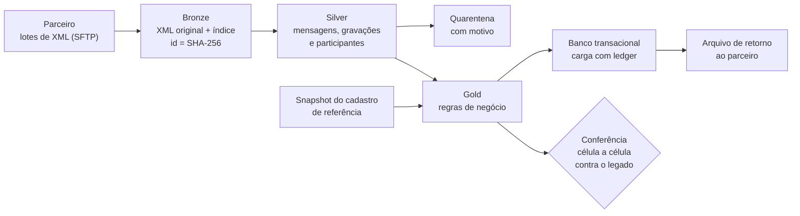

# ddex-medallion-pipeline

[](https://github.com/BrunoMaia23/ddex-medallion-pipeline/actions/workflows/testes.yml)

Versão pública e reduzida de um projeto que fiz no trabalho: trocar um importador legado, feito em
Delphi, por um pipeline em camadas com Spark e Apache Iceberg. O código daqui foi escrito do zero
para este repositório, e todos os dados são fictícios.

*English: a public, smaller version of a work project. Medallion pipeline on Spark + Iceberg for
DDEX XML (music rights declarations), with a cell-by-cell parity check against the legacy system.
All data is synthetic.*

## Contexto

Toda semana um parceiro manda, por SFTP, um lote com centenas de XML no padrão DDEX. Cada arquivo
declara quem tem os direitos de um conjunto de gravações: ISRC, título, duração, datas,
participantes e titular. O sistema antigo lia esses arquivos, aplicava as regras, gravava no banco
transacional e devolvia ao parceiro um arquivo com o status de cada declaração.

As regras ficavam misturadas com o código das telas e não tinham teste. Reprocessar um lote era
manual, e quando dava problema era difícil saber onde. Também não havia como mostrar que uma versão
nova fazia o mesmo que a antiga. Antes de qualquer virada, o pipeline novo rodou em modo sombra em
homologação, em paralelo com o legado, com conferência diária e relatório por e-mail.

## Como funciona



Cada etapa é um comando da CLI, e a DAG do Airflow chama um por tarefa:

- `ingerir` copia o XML como chegou e registra o arquivo no índice do bronze. O id é o SHA-256 do
  conteúdo, então um reenvio com outro nome não entra de novo.
- `ler` lê os XML com `iterparse` e grava mensagens, gravações e participantes no silver. O que não
  passa no portão de qualidade vai para a quarentena com o motivo.
- `auditar` mede o silver e grava um relatório. Não bloqueia nada.
- `referencias` atualiza o snapshot dos ISRCs que já existem no banco.
- `regras` faz o join com a referência no Spark e aplica as regras de negócio, que são funções
  puras com teste.
- `carregar` grava no banco com uma transação por arquivo e um SAVEPOINT por gravação.
- `retorno` gera o XML de status para o parceiro, com um manifesto que tem o hash do arquivo.
- `reconciliar` confere as contas entre raw, índice, silver, gold, ledger, banco e retorno.
- `conferir` compara o resultado com a saída do legado, célula a célula.

Todas as tabelas são Iceberg. Silver, quarentena e gold são particionadas por lote, e reprocessar é
sempre regravar o lote inteiro. O estado de cada arquivo no índice só muda no fim da etapa, num
MERGE, então se algo quebra no meio o arquivo continua onde estava e a próxima execução refaz.

A conferência casa os dois lados por mensagem + ISRC e olha cada célula. Toda diferença precisa
estar numa família conhecida, por exemplo "o legado corta o título em 40 caracteres". Diferença sem
família, ou gravação que só existe de um lado, reprova a conferência.

## Produção x este repositório

Aqui roda a mesma stack, só que numa máquina só. A única troca de motor é o banco de destino.

| | Produção | Aqui |
|---|---|---|
| Processamento | Spark 4.0.1 em modo local, no nó principal do cluster Hadoop | Spark 4.0.1, modo local |
| Tabelas | Apache Iceberg 1.11, catálogo hadoop | igual |
| Armazenamento | HDFS | pasta local |
| Leitura do XML | `iterparse`, em processos paralelos | `iterparse`, sequencial |
| Qualidade | portão em Python + auditoria com Great Expectations | portão em Python + auditoria em JSON |
| Banco de destino | Oracle (`python-oracledb`) | SQLite, com a mesma lógica de transação |
| Entrada | SFTP do parceiro (`paramiko`) | pasta com lotes fictícios |
| Retorno | gerado e entregue por SFTP (entrega desligada no modo sombra) | gerado numa pasta |
| Orquestração | Airflow | CLI; a DAG em `dags/` é só exemplo |
| Legado na conferência | banco de produção, só leitura | `legado.csv` fictício |

## Algumas decisões

- Iceberg com catálogo do tipo hadoop em cima do HDFS que já existia. Deu ACID, time travel e
  evolução de schema sem subir metastore nem serviço novo.
- Spark em modo local no nó principal, gravando no HDFS. O trabalho pesado fica no driver (leitura
  em processos paralelos e carga no banco), e distribuir o runtime do Iceberg pelo cluster
  standalone se mostrou instável.
- `iterparse` em vez do leitor XML do Spark, que perde o cabeçalho da mensagem e carrega o arquivo
  inteiro. Lendo em streaming, a memória fica estável mesmo com arquivo de centenas de MB.
- Os registros entram no Spark por um NDJSON que a própria JVM lê, sem passar por worker Python.
- O ledger da carga é gravado depois do COMMIT, e o banco tem chave única em mensagem + ISRC. Se o
  processo cair entre os dois, a chave recusa a cópia e o ledger é refeito na execução seguinte.

## Rodando

Com Docker, que é o jeito mais simples (inclusive no Windows):

```bash
docker build -t ddexpipe .
docker run --rm ddexpipe
```

Ou localmente, com Java 17 e Python 3.10 a 3.13:

```bash
python -m venv .venv
source .venv/bin/activate          # Windows: .venv\Scripts\activate
pip install -e ".[dev]"

python -m ddexpipe demo            # gera os dados, roda o pipeline duas vezes e confere
pytest
```

Na primeira execução o Spark baixa o runtime do Iceberg (uns 45 MB) do Maven Central. No Windows
o Spark local também precisa do `winutils.exe` (variável `HADOOP_HOME`); sem ele, use Docker ou WSL.

Para rodar uma etapa de cada vez, como a DAG faz, gere os dados com
`python -m ddexpipe gerar --base dados` e chame cada comando com `--base dados`. O comando `rodar`
executa todas em ordem.

### Saída da demo

```
[dados]      2 lotes, 24 mensagens, 129 gravações fictícias

== 1ª execução
[bronze]     27 arquivos novos, 1 já recebidos (mesmo hash)
[silver]     24 arquivos lidos, 120 gravações | quarentena de arquivo: TIPO_NAO_SUPORTADO 1, XML_INVALIDO 2 | quarentena de registro: DURACAO_INVALIDA 3, ISRC_INVALIDO 5, TITULO_AUSENTE 1
[auditoria]  120 gravações no silver, 0 ISRC fora do padrão, 0 ISRC repetido (não bloqueia; relatório em auditoria/)
[referência] snapshot com 8 ISRCs já cadastrados
[gold]       107 gravações carregáveis | rejeitadas: RECURSO_DE_TESTE 6, SEM_DATA 7 | críticas: ISRC_JA_CADASTRADO 8
[carga]      24 arquivos, 107 gravações inseridas, 0 já estavam no banco, 0 com erro
[retorno]    24 mensagens com retorno, 24 arquivos novos na saída
[reconciliação] OK: as contas fecham entre todas as camadas.
[conferência] 107 gravações nos dois lados -> 428 células: 129 iguais, 299 diferentes e explicadas
              0 gravações de um lado só | 0 diferenças NÃO explicadas
     107  TITULO_MAIUSCULO_CORTADO: O legado grava o título em maiúsculas e corta em 40 caracteres.
     104  DURACAO_EM_MINUTOS: O legado arredonda a duração para baixo, em minutos inteiros.
      88  LEGADO_PREFERE_DATA_DE_CRIACAO: Com data de lançamento e de criação, o legado usa a de criação; o novo usa a de lançamento.
[conferência] OK: toda diferença tem explicação.

== 2ª execução (nada pode mudar)
[bronze]     0 arquivos novos, 28 já recebidos (mesmo hash)
[silver]     0 arquivos lidos, 0 gravações | quarentena de arquivo: nenhuma | quarentena de registro: nenhuma
[auditoria]  120 gravações no silver, 0 ISRC fora do padrão, 0 ISRC repetido (não bloqueia; relatório em auditoria/)
[referência] snapshot com 8 ISRCs já cadastrados
[gold]       0 gravações carregáveis | rejeitadas: nenhuma | críticas: nenhuma
[carga]      0 arquivos, 0 gravações inseridas, 0 já estavam no banco, 0 com erro
[retorno]    24 mensagens com retorno, 0 arquivos novos na saída
[reconciliação] OK: as contas fecham entre todas as camadas.
[conferência] 107 gravações nos dois lados -> 428 células: 129 iguais, 299 diferentes e explicadas
              0 gravações de um lado só | 0 diferenças NÃO explicadas
     107  TITULO_MAIUSCULO_CORTADO: O legado grava o título em maiúsculas e corta em 40 caracteres.
     104  DURACAO_EM_MINUTOS: O legado arredonda a duração para baixo, em minutos inteiros.
      88  LEGADO_PREFERE_DATA_DE_CRIACAO: Com data de lançamento e de criação, o legado usa a de criação; o novo usa a de lançamento.
[conferência] OK: toda diferença tem explicação.

[idempotência] totais idênticos depois da 2ª execução: sim -> {'bronze': 27, 'silver': 120, 'gold': 107, 'rejeicoes': 13, 'banco': 107, 'retornos': 24}
```

Na segunda execução nada entra e os totais não mudam. Os testes cobrem também o caminho ruim:
diferença nova no legado, gravação que só existe de um lado, arquivo alterado depois de recebido e
falha no meio da carga, que é retomada sem duplicar nada.

## O que ficou

Comparar só contagens não mostra se o conteúdo bate. O que me deu confiança de que o novo fazia o
mesmo que o legado foi olhar célula a célula, casando pela chave natural, e dar nome a cada
diferença. Com nome, cada uma vira uma decisão: manter o comportamento antigo ou corrigir de
propósito.

Mais duas coisas que levo para outros projetos. O estado de um arquivo só avança depois que o
trabalho terminou, senão o retry fica verde e esconde a falha. E um lote só está conferido quando
está completo dos dois lados.

Rodar em sombra antes da virada achou problemas que nenhum teste com dado de exemplo pegaria.

## Stack

Produção: Python, Spark, Iceberg, HDFS, Airflow, Great Expectations, Oracle (`python-oracledb`) e
`paramiko`. Aqui: Python, PySpark 4.0.1, Iceberg 1.11, SQLite, pytest, GitHub Actions e Docker.
